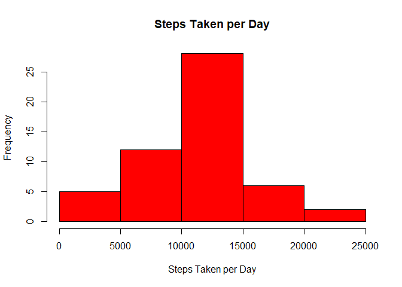
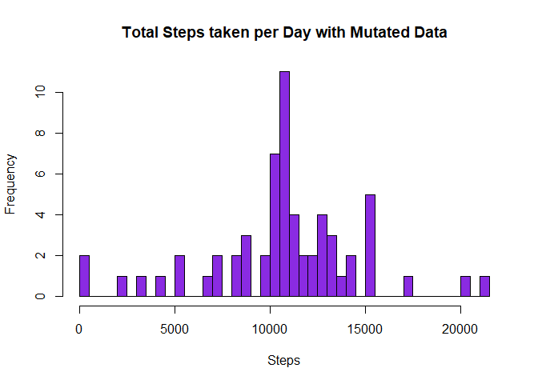
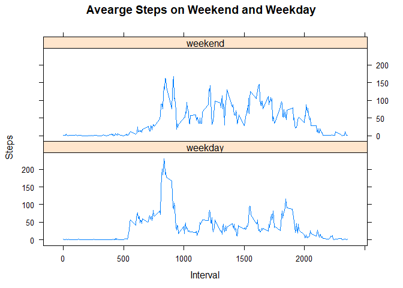

# Reproducible Research: Peer Assessment 1


## Loading and preprocessing the data

1. Unzip the file

```r
zipFile = 'activity.zip'
csvFile = 'activity.csv'
if (!file.exists(csvFile)){unzip(zipFile, csvFile)}
```

2. Load the data

```r
activity = read.csv(csvFile)
```

3. Process/transform the data

```r
activity$date = as.Date(activity$date)
head(activity)
```

```
##   steps       date interval
## 1    NA 2012-10-01        0
## 2    NA 2012-10-01        5
## 3    NA 2012-10-01       10
## 4    NA 2012-10-01       15
## 5    NA 2012-10-01       20
## 6    NA 2012-10-01       25
```


## What is mean total number of steps taken per day?
1. Calculate the total number of steps taken per day

```r
stepsPerDay =  aggregate(steps ~ date, activity, FUN = sum, na.action = na.omit)
```

2. Make a histogram of the total number of steps taken each day

```r
hist(stepsPerDay$steps, col = "red", main = "Steps Taken per Day", xlab = 'Steps Taken per Day')
```

<!-- -->

3. Calculate and report the mean and median of the total number of steps taken per day

```r
mean.steps = mean(stepsPerDay$steps)
median.steps = median(stepsPerDay$steps)
```
The average steps taken per day is 1.0766189\times 10^{4}. The median is 10765.


## What is the average daily activity pattern?
1. Make a time series plot of the 5-minute interval and the average number of steps taken, averaged across all days.

```r
stepsByInterval = aggregate(steps ~ interval, activity, FUN = mean, na.action = na.omit)
plot(stepsByInterval$interval, stepsByInterval$steps, type = 'l', 
     main = 'Average Daily Activity Pattern',
     xlab = 'Interval', ylab = 'Steps')
```

<!-- -->

2. Find the interval that contains the max step

```r
max.steps = stepsByInterval$interval[which.max(stepsByInterval$steps)]
```
The interval that contains the max step is 835.

## Imputing missing values
1. Calculate and report the total number of missing values in the dataset.

```r
na.value = sum(is.na(activity))
```
THe total number of missing value is 2304.


2. Create a new dataset that is equal to the original dataset but with the missing data filled in.

```r
activity.mutated = activity
```

3. Use mean for that 5-minute interval to fill the na value

```r
for (i in 1:length(activity.mutated$step)){
    if (is.na(activity.mutated$step[i])){
        activity.mutated$steps[i] = stepsByInterval$steps[stepsByInterval$interval == activity.mutated$interval[i]]
    }
}
head(activity.mutated)
```

```
##       steps       date interval
## 1 1.7169811 2012-10-01        0
## 2 0.3396226 2012-10-01        5
## 3 0.1320755 2012-10-01       10
## 4 0.1509434 2012-10-01       15
## 5 0.0754717 2012-10-01       20
## 6 2.0943396 2012-10-01       25
```

4. Make a histogram of the total number of steps taken each day.

```r
total.steps.taken.per.day = aggregate(steps ~ date, activity.mutated, FUN = sum)
hist(total.steps.taken.per.day$steps, breaks = nrow(total.steps.taken.per.day), 
     main = "Total Steps taken per Day with Mutated Data", xlab = "Steps", col = 'blueviolet')
```

<!-- -->

5. Find and report the mean and medan total number of steps taken per day.

```r
mean.steps.1 = mean(total.steps.taken.per.day$steps)
median.steps.1 = median(total.steps.taken.per.day$steps)
```
The mean total number of steps taken per day is 1.0766189\times 10^{4}, and the median is 1.0766189\times 10^{4}.

## Are there differences in activity patterns between weekdays and weekends?
1. Create a new factor variable in the dataset with two levels - "weekday" and "weekend" indicating whether a given date is a weekday or weekend day.

```r
weekday = weekdays(activity.mutated$date)
activity.mutated$dayType = ifelse(weekday == 'Sunday'|weekday =='Saturday', 'weekend', 'weekday')
```

2. Make a panel plot containing a time series plot (i.e. type = "l") of the 5-minute interval (x-axis) and the average number of steps taken, averaged across all weekday days or weekend days (y-axis).

```r
stepsPerDay.mutated = aggregate(steps~interval+dayType, data = activity.mutated, FUN = mean)

library(lattice)
xyplot(steps ~ interval | dayType, stepsPerDay.mutated, layout = c(1,2), type = 'l',
       main = "Avearge Steps on Weekend and Weekday", xlab = "Interval", ylab = "Steps")
```

<!-- -->

